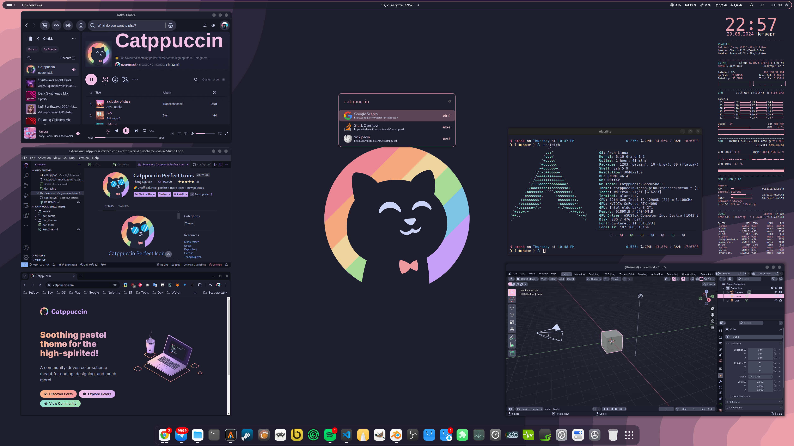
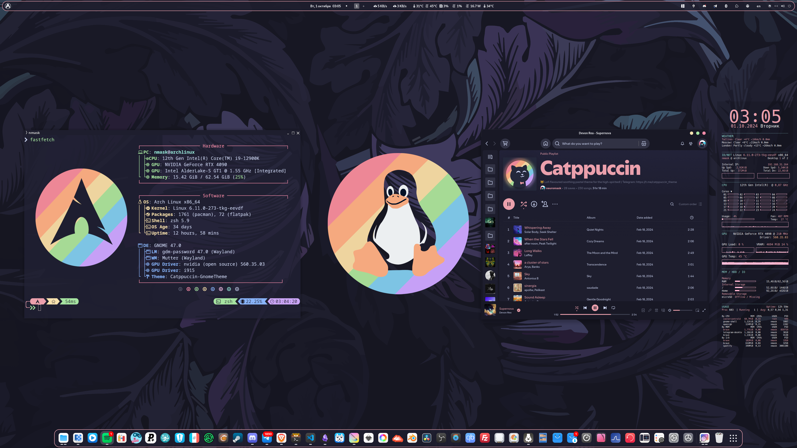
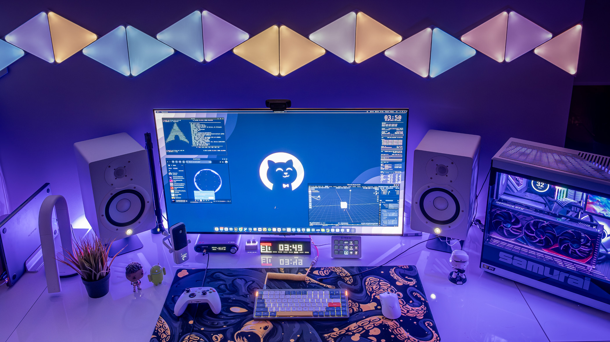
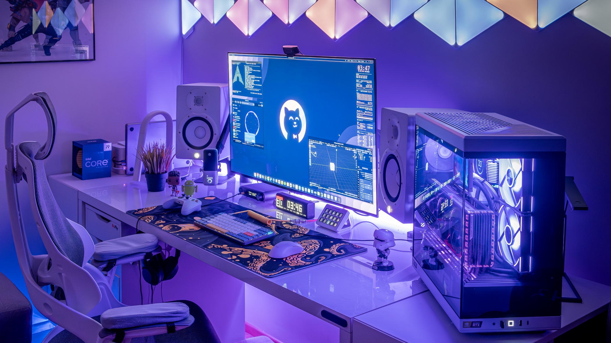

<h1 align="center">Catppuccin Linux Theme</h1>

    
	 
     
    
     

<h4 align="center">Telegram Catppuccin Wallpapers and more https://t.me/catppuccin_theme</h4>

## 🐱 Preview ᓚ₍ ^. .^₎

	
	
	
	

> [!NOTE]
> _This theme is created for newbies and mediocre Linux users and aims to provide app names and styles. You can follow these steps to install apps and modify different parts of Linux UI.  
> There is no one command/app to get Catppuccin Theme applied, it's necessary to set it up step by step for yourself.  
> If you have an exact question regarding some parts you want to install to match the Catppuccin Theme, I'm glad to help._

## 🌟 Media (˶˃ ᵕ ˂˶)

### 🔹 Wallpaper
https://t.me/catppuccin_theme  
Download wallpapers in Telegram Channel

### 🔹 Youtube video
https://youtu.be/7wIWAlp8DGY | https://youtu.be/UBSmT51ljUA   

### 🔹 Spotify Playlist
https://spti.fi/catppuccin  
Listen to inspiring, soothing pastel Lo-Fi while customizing your comfy place.  

## 🦆 GNOME Theme ≽^•⩊•^≼

### 🔹 Shell Theme
Relevant Files: `/dot_files/.themes/Catppuccin-GnomeTheme`  
Use [Gnome Tweaks](https://docs.rockylinux.org/desktop/gnome/gnome-tweaks/) to select and apply.  
Copy `Catppuccin-GnomeTheme/gtk-4.0` folder here `/home/.config/gtk-4.0`  
Copy `Catppuccin-GnomeTheme/gtk-3.0` folder here `/home/.config/gtk-3.0`  

**Flatpack Apps** | [Guide](https://itsfoss.com/flatpak-app-apply-theme/)  
Enable GTK theme for Flatpack apps run:  
`sudo flatpak override --filesystem=$HOME/.themes`  
`sudo flatpak override --env=GTK_THEME=Catppuccin-GnomeTheme`  

### 🔹 Gradience
App: https://gradienceteam.github.io / https://github.com/GradienceTeam/Gradience  
Import to Gradience and apply Catppuccin Mocha Maroon theme from this repo `/.config/presets/user`  

### 🔹 Dock Icons  
Relevant Files: `/dot_files/.icons/WhiteSur.zip`  
Use [Gnome Tweaks](https://docs.rockylinux.org/desktop/gnome/gnome-tweaks/) to select and apply.   

**Icons**
[WhiteSur](https://www.gnome-look.org/p/1405756) / https://github.com/vinceliuice/WhiteSur-icon-theme  
[Mkos-Big-Sur](https://www.gnome-look.org/p/1400021) / https://github.com/zayronxio/Mkos-Big-Sur  

### 🔹 Extension Manager
App: https://github.com/mjakeman/extension-manager  
Website: https://extensions.gnome.org/ |  [Chrome Extension](https://chromewebstore.google.com/detail/gnome-shell-integration/gphhapmejobijbbhgpjhcjognlahblep)  

**Entesions**
- [Dash to Dock](https://github.com/micheleg/dash-to-dock) - Control Dock Icons
- [Desktop Cube](https://github.com/Schneegans/Desktop-Cube) - 3D Workspace Switcher
- [Tiling Shell](https://github.com/domferr/tilingshell) - Windows tiling system
- [Space Bar](https://github.com/christopher-l/space-bar) - Workspace Indicator in Topbar
- [Burn My Windows](https://github.com/Schneegans/Burn-My-Windows) - Window animation effects
- [Fly Pie](https://github.com/Schneegans/Fly-Pie/tree/main) - Quick Navigation (or use Ulauncher app instead)
- [Compiz windows effect](https://github.com/hermes83/compiz-windows-effect) - Window drag effects
- [Blur my Shell](https://github.com/aunetx/blur-my-shell) - Adding blur effects
- [Arc Menu](https://github.com/fishears/Arc-Menu) - App launcher in Topbar
- [Clipboard Indicator](https://github.com/Tudmotu/gnome-shell-extension-clipboard-indicator) - Stores clipboard history
- [Caffeine](https://github.com/eonpatapon/gnome-shell-extension-caffeine) - Never sleep
- [Emoji Copy](https://github.com/FelipeFTN/Emoji-Copy) - Quick emoji in Topbar
- [Vitals](https://github.com/corecoding/Vitals) - System Monitor

## 🍉 Catppuccinize Apps ^·-·^

### 🔹 Visual Studio Code
https://github.com/catppuccin/vscode - Mocha Theme  
You can download Catppuccin Mocha Theme and Icons as modules in VSC  

### 🔹 Stylus / Browser Extension
Relevant Files: [other/stylus](other/stylus)  
[Chrome / Edge / Brave / Arc](https://chromewebstore.google.com/detail/stylus/clngdbkpkpeebahjckkjfobafhncgmne?pli=1) | [Firefox](https://addons.mozilla.org/en-US/firefox/addon/styl-us/)  
Add Stylus browser extension, import `.json` file, update styles and sync with your cloud.  
You can also select your own accent colors and generate `.json` [here](https://ctp-aui.uncenter.dev/).  
### 🔹 Spotify / Spicetify
Website: https://spicetify.app/ | [Installation Guide](https://spicetify.app/docs/advanced-usage/installation/)  
Install Spicetify and search in Themes for Catppuccin with Mocha accent

### 🔹 Blender
Relevant Files: [dot_files/.config/blender](dot_files/.config/blender)  
Website: https://github.com/Dalibor-P/blender  
Open Blender's settings and theme installation dialogue: `Edit → Preferences → Themes → Install.`  
Browse and install the .xml file.  

### 🔹 Conky System Monitor
Relevant Files: [dot_files/.config/conky](dot_files/.config/conky)  
Website: https://github.com/brndnmtthws/conky  
Theme Installation: Add conky folder to your .config folder
Autostart: Add start_conky.desktop to home/.autostart/start_conky.desktop

### 🔹 Ulauncher App Launcher
Relevant Files: [dot_files/.config/ulauncher](dot_files/.config/ulauncher)  
Website: https://ulauncher.io/  
Install Mocha Maroon theme: Add ulauncher folder to your ./config folder  
Alternatively, you can install from here: https://github.com/catppuccin/ulauncher  

### 🔹 Discord
Website: https://betterdiscord.app/ | [Installation Guide](https://gist.github.com/ObserverOfTime/d7e60eb9aa7fe837545c8cb77cf31172)  
Simply add your CSS into your discord settings BetterDiscord > CustomCSS:  
`@import url("https://catppuccin.github.io/discord/dist/catppuccin-mocha.theme.css");`  

### 🔹 Telegram
Website: https://telegram.org/  
Install [Catppuccin Mocha Telegram Theme](https://t.me/addtheme/ctp_mocha)  
After select it in the Telegram settings.

### 🔹 Tauon
Website: https://github.com/Taiko2k/Tauon  
Relevant Files: [dot_files/.config/tauon](dot_files/.config/tauon)  
Open `Menu > Settings > Function > Open data folder`  
Place `Catppuccin.ttheme` inside theme folder.  

### 🔹 qBittorrent
Relevant Files: [dot_files/.config/qbittorrent](dot_files/.config/qbittorrent)  
Website: https://www.qbittorrent.org/  
Open qBittorrent and go to `Tools > Preferences > Behaviour`  
Tick the "use custom UI theme" checkbox and select your chosen .qbtheme theme file.  
Click Apply and restart qBittorrent for the changes to take effect.  

## 🤖 Terminal ₍^. ̫.^₎

### 🔹 Kitty Terminal
Relevant Files: [dot_files/.config/kitty](dot_files/.config/kitty)  
Website: https://github.com/kovidgoyal/kitty | [Installation Guide](https://sw.kovidgoyal.net/kitty/binary/)  
Themes: https://github.com/dexpota/kitty-themes   
Note: If you're using Kitty `>0.26.0`, all Catppuccin flavors are already included in Kitty!  

### 🔹 Black Box Terminal
Relevant Files: [dot_files/.config/tilix/schemes](dot_files/.config/tilix/schemes)  
Website: https://github.com/yonasBSD/blackbox-terminal  
Catppuccin Theme, you can use Tilix Terminal Profile - it's the same.  
Open Black Box, browse, and select theme in Preferences.  

### 🔹 Tilix Terminal
Relevant Files: [dot_files/.config/tilix/schemes](dot_files/.config/tilix/schemes)  
Website: https://gnunn1.github.io/tilix-web/  
Open Tilix and select your Tilix profile in Preferences.  
Click the "Colors" tab and select your theme.  

### 🔹 Alacritty Terminal
Relevant Files: [dot_files/.config/alacritty](dot_files/.config/alacritty)  
Website: https://alacritty.org/ | [Installation Guide](https://github.com/alacritty/alacritty/blob/master/INSTALL.md)  
Themes: https://github.com/rajasegar/alacritty-themes   

### 🔹 Any Terminal Contex Menu
https://github.com/Stunkymonkey/nautilus-open-any-terminal  
Adds option to open any terminal with a right-click from the context menu, rather than standard Gnome Console.  
Use Gnome [Dconf Editor](https://apps.gnome.org/ru/DconfEditor/) to setup default terminal for context menu:  
`/com/github/stunkymonkey/nautilus-open-any-terminal/terminal`  

## 🤓 CLI Apps ₍^. ̫.^₎

### 🔹 Neovim
Website: https://neovim.io/  
Config / Catppuccin Theme: https://nvchad.com/  | [Installation Guide](https://nvchad.com/docs/quickstart/install)  
After installation press `(space) t h` to select Catppuccin Theme.  

### 🔹 Cava
Relevant Files: [dot_files/.config/cava](dot_files/.config/cava)  
Website: https://github.com/karlstav/cava  
Cava is a bar spectrum audio visualizer for terminal or desktop (SDL).

### 🔹 Yazi
Relevant Files: [dot_files/.config/yazi](dot_files/.config/yazi)  
Website: https://github.com/sxyazi/yazi | [Installation Guide](https://yazi-rs.github.io/docs/installation)  
Blazing fast terminal file manager  

### 🔹 BTOP
Relevant Files: [dot_files/.config/btop](dot_files/.config/btop)  
Website: https://terminaltrove.com/btop/  
Resource monitor for the terminal.  
Launch Btop/Bpytop, press `Esc`, and select "Options".  
Select Catppuccin Theme!  

### 🔹 ZSH Shell
Relevant Files: [dot_files/.zshrc](dot_files/.zshrc)  
Shell: [Installation Guide](https://github.com/ohmyzsh/ohmyzsh/wiki/Installing-ZSH)  

### 🔹 Oh My Posh
Website: https://ohmyposh.dev/ | [Installation Guide](https://ohmyposh.dev/docs/installation/linux)  
Init / Theme setup: `eval "$(oh-my-posh init zsh --config ~/_yourpath_/config.json)"`  
Install fonts: `oh-my-posh font install`  
Font: Hack Nerd Font  
Cheat Sheet: https://www.nerdfonts.com/cheat-sheet  

### 🔹 Oh My ZSH!
Website: https://ohmyz.sh/ | [Installation Guide](https://gist.github.com/yovko/becf16eecd3a1f69a4e320a95689249e)  
Themes to choose: "duellj", "agnoster"  
https://github.com/ohmyzsh/ohmyzsh/wiki/Themes  

### 🔹 Fastfetch
Relevant Files: [dot_files/.config/fastfetch](dot_files/.config/fastfetch)  
Website: https://github.com/fastfetch-cli/fastfetch | [Installation Guide](https://github.com/dylanaraps/neofetch/wiki/Installation)  

### 🔹 Neofetch
Relevant Files: [dot_files/.config/neofetch](dot_files/.config/neofetch)  
Website: https://github.com/dylanaraps/neofetch | [Installation Guide](https://itsfoss.com/fine-control-fastfetch/)  
Themes: https://github.com/Chick2D/neofetch-themes  

### 🔹 Chezmoi
Website: https://www.chezmoi.io/  
Manage your dotfiles across multiple diverse machines, securely.

## 🍇 Install Apps ≽^-˕-^≼

### 🔹 CLI Apps
- [Asciiquarium](https://github.com/nothub/asciiquarium) | [aur](https://aur.archlinux.org/packages/asciiquarium-transparent-git) - Aquarium/sea animation in ASCII art
- [BTOP](https://terminaltrove.com/btop/) - System Monitor
- [Cava](https://github.com/karlstav/cava) - Music visualizer
- [Cbonsai](https://github.com/mhzawadi/homebrew-cbonsai) - Bonsai tree generator
- [Musikcibe](https://github.com/clangen/musikcube) - Audio engine, library, player
- [Ncspot](https://github.com/hrkfdn/ncspot) - Spotify client
- [Neo VIM](https://neovim.io/) | [Nvchad](https://nvchad.com/) - Hyperextensible Vim-based text editor
- [Neo matrix](https://github.com/st3w/neo) | [aur](https://aur.archlinux.org/packages/neo-matrix-git) | [Cmatrix](https://github.com/abishekvashok/cmatrix) - Matrix rain generator screensaver
- [Pipes.sh](https://github.com/pipeseroni/pipes.sh) | [Pipes-rs](https://github.com/lhvy/pipes-rs) - Pipes screensaver
- [Pyradio](https://github.com/catppuccin/pyradio) - Internet radio (theme select: `t` and `space`)
- [Yazi](https://github.com/sxyazi/yazi) - File manager

### 🔹 Games
- [Heroic Games Launcher](https://heroicgameslauncher.com/) - Epic, GOG and Amazon Prime Games launcher
- [Lutris](https://lutris.net/) - Game launcher
- [Modrinth](https://modrinth.com/) - Minecraft launcher
- [PortProton](https://linux-gaming.ru/) - Game launcher
- [RetroArch](https://www.retroarch.com/) - Classic game launcher
- [ProtonUp](https://davidotek.github.io/protonup-qt/) - Proton GUI installer
- [ProtonPlus](https://github.com/Vysp3r/ProtonPlus) - Gnome Proton GUI installer
- [Ryujinx](https://ryujinx.org/) - Nintendo Switch emulator
- [Steam](https://store.steampowered.com/) - Game Library

### 🔹 Music
- [Audacity](https://www.audacityteam.org/) - Audio files editor
- [Amberol](https://github.com/adamjatim/amberol) - Music player
- [Blanket](https://github.com/rafaelmardojai/blanket) - Listen to different ambient sounds
- [Cider](https://cider.sh/) - Apple Music player
- [Cozy](https://cozy.sh/) - Modern audiobook player 
- [Lollypop](https://wiki.gnome.org/Apps/Lollypop) - Music player
- [Spotify](https://open.spotify.com/) - Music player
- [Spotude](https://spotube.krtirtho.dev/) - Open source Spotify client

### 🔹 Video
- [Davinci Resolve](https://www.blackmagicdesign.com/products/davinciresolve) - Video Editor
- [Handbrake](https://handbrake.fr/) - Video converter
- [OBS](https://obsproject.com) - Stream and video record
- [Shutter Encoder](https://www.shutterencoder.com/) - Video Converter
- [Showtime](https://kramo.page/showtime/) - Video player
- [VLC](https://www.videolan.org/vlc/) - Media player

### 🔹 Messenger
- [Discord](https://discord.com/) - Messenger
- [Element](https://element.io/) - Messenger
- [Telegram](https://telegram.org/) - Messenger
- [Vencord](https://vencord.dev/) - Discord client

### 🔹 Broswers
- [Brave](https://brave.com/) - Browser with ad-blocker
- [Chrome](https://www.google.com/intl/en/chrome/) - Browser
- [Tor](https://www.torproject.org/) - Secure browser
- [Zen](https://zen-browser.app/) - Mozilla based browser

### 🔹 AI
- [Alpaca](https://github.com/Jeffser/Alpaca) - Manage and chat with multiple models
- [Jan](https://jan.ai/) - AI text model manager and server
- [StabilityMatrix](https://github.com/LykosAI/StabilityMatrix) - AI engines manager
- [Upskayl](https://upscayl.org/) - Image upscaler

### 🔹 Misc
- [AppFlowy](https://www.appflowy.io/) - Notes
- [Beekeeper Studio](https://www.beekeeperstudio.io/) - Database manager
- [BleachBit](https://www.bleachbit.org/) - Cleaner
- [Blender](https://www.blender.org/) - 3D editor
- [Conky](https://github.com/brndnmtthws/conky) - System Monitor
- [CoolerControl](https://gitlab.com/coolercontrol/coolercontrol) - Fan controller
- [Etcher](https://etcher.balena.io/) - USB image maker
- [Filezilla](https://filezilla-project.org/) - FTP Client
- [Flameshot](https://flameshot.org/) - Screenshot capturer
- [Flathub](https://flathub.org/) - App manager
- [Flatseal](https://github.com/tchx84/flatseal) - Permissions for Flatpak applications
- [Fontbase](https://fontba.se/) - Font manager
- [Furnace](https://github.com/tildearrow/furnace) - Chiptune tracker
- [Gear Lever](https://mijorus.it/projects/gearlever/) - Appimage manager
- [GPU-Viewer](https://github.com/arunsivaramanneo/GPU-Viewer) - GPU Info
- [Gnome tweaks](https://gitlab.gnome.org/GNOME/gnome-tweaks) - Gnome tweaker
- [Gparted](https://gparted.org/) - Partition manager
- [Gradience](https://gradienceteam.github.io/) - Gnome theme manager
- [Inkscape](https://wiki.inkscape.org/wiki/Installing_Inkscape) - Vector editor
- [Input Remapper](https://github.com/sezanzeb/input-remapper) - Remap keys, macros
- [Kitty](https://sw.kovidgoyal.net/kitty/) - Terminal
- [Krita](https://krita.org/) - Photoshop analogue
- [Mailspring](https://www.getmailspring.com/) - Mail client
- [Mission Center](https://missioncenter.io/) - Monitor your CPU, Memory, Disk, Network and GPU
- [LocalSend](https://localsend.org/) - Airdrop alternative, local files sharing
- [Notepad Next](https://github.com/dail8859/NotepadNext) - Reimplementation of Notepad++
- [OpenRGB](https://openrgb.org/) - Control RGB lights
- [Postman](https://www.postman.com/) - DB Request manager
- [Remmina](https://remmina.org/) - Remote desktop
- [Stacer](https://oguzhaninan.github.io/Stacer-Web/) - System information & Cleaner
- [Timeshift](https://github.com/teejee2008/timeshift) - Backup manager
- [Ulauncher](https://ulauncher.io/) - Neat app launcher
- [Ventoy](https://www.ventoy.net/en/index.html) - Multi USB ISO
- [VSC](https://code.visualstudio.com/) - Coding
- [Warehouse](https://github.com/flattool/warehouse) - Managing Flatpak user data
- [Waydroid](https://waydro.id/) - Android emulator
- [Wireshark](https://www.wireshark.org/) - Network protocol analyzer
- [qBittorrent](https://www.qbittorrent.org/) - Torrent client

## 💾 System ≽^-˕-^≼

### 🔹 Recovery USB & Repair ISO
> [!NOTE]
> _Use [Ventoy App](https://www.ventoy.net/) to create USB stick with all needed tools to recover system._  
- [Boot Repair Disk](https://sourceforge.net/p/boot-repair-cd/home/Home/) - Rescue Disk
- [Clonezilla](https://clonezilla.org/) - Partition and disk imaging/cloning program
- [Foxclone](https://foxclone.org/) - Backup, restore and clone tool 
- [GParted](https://gparted.org/livecd.php) - Live CD for GParted app
- [Redo Rescue](http://redorescue.com/) - Restores your system to perfect condition
- [Super Grub2 Disk](https://www.supergrubdisk.org/) - Helps you to boot into most any OS
- [System Rescue](https://www.system-rescue.org/) - Linux system rescue toolkit
- [Fedora Live](https://fedoraproject.org/) - Boot to Fedora Live USB
- [Knoppix Live](https://www.knopper.net/knoppix/index-en.html) - Boot to Knoppix Live USB 
- [Manjaro Live](https://manjaro.org/) - Boot to Manjaro Live USB

### 🔹 System Specs
- CPU: 12th Gen Intel i9-12900K (24) @ 5.100GHz  
- GPU: NVIDIA GeForce RTX 4090  
- GPU Driver: NVIDIA 560.35.03  
- Memory: 64Gb  
- OS: Arch Linux  
- Kernel: Linux 6.11.0-5-cachyos  
- Shell: zsh 5.9  
- Resolution: 3840x2160 @ 120Hz OLED LG 42"  
- DE: GNOME 47  

## 💥 Kernel & Arch Linux Speedup ⚞ • ⚟
> [!NOTE]
> _This small guide is for Arch Linux users ONLY to speed it up with CachyOS kernel, repository and settings!_  
[**Overall Guide**](https://medium.com/illumination/solving-distro-hopping-by-building-the-ultimate-arch-7f431a825861)
### 🔹 CachyOS Repository
[Installation Guide](https://wiki-dev.cachyos.org/sk/cachyos_repositories/how_to_add_cachyos_repo/)  
### 🔹 CachyOS Kernel
[Installation Guide](https://wiki-dev.cachyos.org/sk/configuration/kernel-manager/#cachyos-kernel-manager)  
`sudo pacman -S cachyos-kernel-manager`  
I suggest to install **linux-cachyos-eevdf** kernel.  
### 🔹 CachyOS Settings & Tweaks
[Installation Guide](https://wiki.cachyos.org/features/cachyos_settings/)  
`sudo pacman -S cachyos-settings`  
[Tweaks](https://wiki.cachyos.org/configuration/general_system_tweaks/) - get some tweaks  

## :incoming_envelope: Contact ⚞ • ⚟

Telegram: [neuromask](https://t.me/neuromask) 
Reddit: [Reddit Profile](https://www.reddit.com/user/neuromask/) 
Website: [Nuforms Design](https://nuforms.com) 
Telegram Catppuccin Wallpapers and more: https://t.me/catppuccin_theme/

