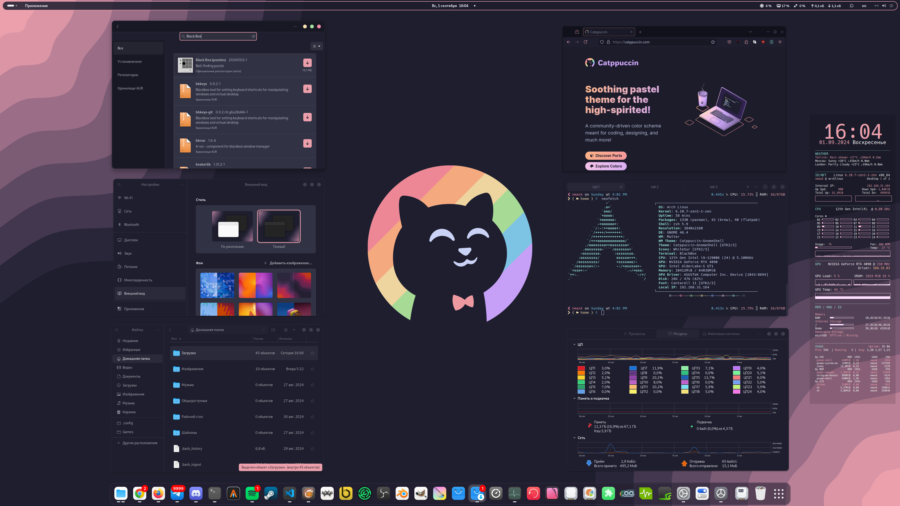
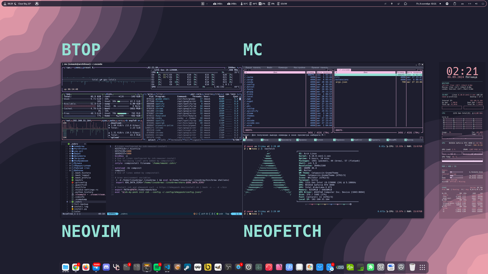

<h1 align="center">Catppuccin Linux Theme</h1>

    
	 
     
    
     

<h4 align="center">Telegram Catppuccin Wallpapers and more https://t.me/catppuccin_theme</h4>

## 🐱 Preview ᓚ₍ ^. .^₎

	
	
	
	

## 🌟 Media (˶˃ ᵕ ˂˶)
### 🔹 Wallpaper
https://t.me/catppuccin_theme  
Download wallpapers in Telegram Channel
### 🔹 Youtube video
https://youtu.be/7wIWAlp8DGY  
Watch Demo Video
### 🔹 Spotify Playlist
https://spti.fi/catppuccin  
Listen to inspiring, soothing pastel Lo-Fi while customizing your comfy place.  

## 🦆 GNOME Theme ≽^•⩊•^≼

### 🔹 Shell Theme  
Download and use Gnome Tweaks to select  
Get from this repo `/dot_files/.themes/Catppuccin-GnomeTheme`  
Place it here `/home/.themes/Catppuccin-GnomeTheme`  
And `Catppuccin-GnomeTheme/gtk-4.0` folder place here `/home/.config/gtk-4.0`  

### 🔹 Gradience
[Gradience](https://gradienceteam.github.io/) / https://github.com/GradienceTeam/Gradience  
Import to Gradience and apply Catppuccin Mocha Maroon theme from this repo `/.config/presets/user`  

### 🔹 Gnome Tweaks 
App: https://docs.rockylinux.org/ru/desktop/gnome/gnome-tweaks/  
Install/use it to control shell theme and dock icons   

### 🔹 Extension Manager
App: https://github.com/mjakeman/extension-manager  
Website: https://extensions.gnome.org/ |  [Chrome Extension](https://chromewebstore.google.com/detail/gnome-shell-integration/gphhapmejobijbbhgpjhcjognlahblep)  

**Entesions**
- [Dash to Dock](https://github.com/micheleg/dash-to-dock) - Control Dock Icons
- [Desktop Cube](https://github.com/Schneegans/Desktop-Cube) - 3D Workspace Switcher
- [Space Bar](https://github.com/christopher-l/space-bar) - Workspace Indicator in Topbar
- [Burn My Windows](https://github.com/Schneegans/Burn-My-Windows) - Window animation effects
- [Fly Pie](https://github.com/Schneegans/Fly-Pie/tree/main) - Quick Navigation (or use Ulauncher app instead)
- [Compiz windows effect](https://github.com/hermes83/compiz-windows-effect) - Window drag effects
- [Blur my Shell](https://github.com/aunetx/blur-my-shell) - Adding blur effects
- [Arc Menu](https://github.com/fishears/Arc-Menu) - App launcher in Topbar
- [Clipboard Indicator](https://github.com/Tudmotu/gnome-shell-extension-clipboard-indicator) - Stores clipboard history
- [Caffeine](https://github.com/eonpatapon/gnome-shell-extension-caffeine) - Never sleep
- [Emoji Copy](https://github.com/FelipeFTN/Emoji-Copy) - Quick emoji in Topbar
- [Vitals](https://github.com/corecoding/Vitals) - System Monitor

### 🔹 Dock Icons  
Download and use Gnome Tweaks to select  
Get from this repo `/dot_files/.icons/WhiteSur.zip`  
Unzip and place it here `/home/.icons/WhiteSur`  

[WhiteSur](https://www.gnome-look.org/p/1405756) / https://github.com/vinceliuice/WhiteSur-icon-theme  
[Mkos-Big-Sur](https://www.gnome-look.org/p/1400021) / https://github.com/zayronxio/Mkos-Big-Sur

## 🍉 Apps ^·-·^

### 🔹 Visual Studio Code
https://github.com/catppuccin/vscode - Mocha Theme  
You can download Catppuccin Mocha Theme and Icons as modules in VSC  

### 🔹 Neovim
Relevant Files: [dot_files/.config/nvim](dot_files/.config/nvim)  
Website: https://neovim.io/ | [Installation Guide](https://github.com/neuromask/nvim-config)  
Plugin / Catppuccin Theme: [dot_files/.config/nvim/lua/nmask/plugins/colorscheme.lua](dot_files/.config/nvim/lua/nmask/plugins/colorscheme.lua)  
### 🔹 Spotify / Spicetify
Website: https://spicetify.app/ | [Installation Guide](https://spicetify.app/docs/advanced-usage/installation/)  
Install Spicetify and search in Themes for Catppuccin with Mocha accent

### 🔹 Blender
Relevant Files: [dot_files/.config/blender](dot_files/.config/blender)  
Website: https://github.com/Dalibor-P/blender  
Open Blender's settings and theme installation dialogue: `Edit → Preferences → Themes → Install.`  
Browse and install the .xml file.  

### 🔹 Conky System Monitor
Relevant Files: [dot_files/.config/conky](dot_files/.config/conky)  
Website: https://github.com/brndnmtthws/conky  
Theme Installation: Add conky folder to your .config folder
Autostart: Add start_conky.desktop to home/.autostart/start_conky.desktop

### 🔹 Ulauncher App Launcher
Relevant Files: [dot_files/.config/ulauncher](dot_files/.config/ulauncher)  
Website: https://ulauncher.io/  
Install Mocha Maroon theme: Add ulauncher folder to your ./config folder  
Alternatively, you can install from here: https://github.com/catppuccin/ulauncher  

### 🔹 Discord
Website: https://betterdiscord.app/ | [Installation Guide](https://gist.github.com/ObserverOfTime/d7e60eb9aa7fe837545c8cb77cf31172)  
Simply add your CSS into your discord settings BetterDiscord > CustomCSS:  
`@import url("https://catppuccin.github.io/discord/dist/catppuccin-mocha.theme.css");`  

You can then keep [betterdiscordctl](https://gist.github.com/ObserverOfTime/d7e60eb9aa7fe837545c8cb77cf31172#install-betterdiscordctl) up to date with this command  
`sudo betterdiscordctl self-upgrade`
### 🔹 Telegram
Website: https://telegram.org/  
Install [Catppuccin Mocha Telegram Theme](https://t.me/addtheme/ctp_mocha)  
After select it in the Telegram settings.

## 🤖 Terminal ₍^. ̫.^₎

### 🔹 Kitty Terminal
Relevant Files: [dot_files/.config/kitty](dot_files/.config/kitty)  
Website: https://github.com/kovidgoyal/kitty | [Installation Guide](https://sw.kovidgoyal.net/kitty/binary/)  
Themes: https://github.com/dexpota/kitty-themes   
Note: If you're using Kitty `>0.26.0`, all Catppuccin flavors are already included in Kitty!  

### 🔹 Black Box Terminal
Relevant Files: [dot_files/.config/tilix/schemes](dot_files/.config/tilix/schemes)  
Website: https://github.com/yonasBSD/blackbox-terminal  
Catppuccin Theme, you can use Tilix Terminal Profile - it's the same.  
Open Black Box, browse, and select theme in Preferences.  

### 🔹 Tilix Terminal
Relevant Files: [dot_files/.config/tilix/schemes](dot_files/.config/tilix/schemes)  
Website: https://gnunn1.github.io/tilix-web/  
Open Tilix and select your Tilix profile in Preferences.  
Click the "Colors" tab and select your theme.  

### 🔹 Alacritty Terminal
Relevant Files: [dot_files/.config/alacritty](dot_files/.config/alacritty)  
Website: https://alacritty.org/ | [Installation Guide](https://github.com/alacritty/alacritty/blob/master/INSTALL.md)  
Themes: https://github.com/rajasegar/alacritty-themes   

### 🔹 Any Terminal Contex Menu
https://github.com/Stunkymonkey/nautilus-open-any-terminal  
Adds option to open any terminal with a right-click from the context menu, rather than standard Gnome Console.  
Use Gnome [Dconf Editor](https://apps.gnome.org/ru/DconfEditor/) to setup default terminal for context menu:  
`/com/github/stunkymonkey/nautilus-open-any-terminal/terminal`  

## 💾 Terminal Apps ₍^. ̫.^₎

### 🔹 BTOP
Relevant Files: [dot_files/.config/btop](dot_files/.config/btop)  
Website: https://terminaltrove.com/btop/  
Resource monitor for the terminal.  
Launch Btop/Bpytop, press `Esc`, and select "Options".  
Select Catppuccin Theme!  

### 🔹 ZSH Shell
Relevant Files: [dot_files/.zshrc](dot_files/.zshrc)  
[Installation Guide](https://github.com/ohmyzsh/ohmyzsh/wiki/Installing-ZSH)  

**Oh My Posh**
Website: https://ohmyposh.dev/ | [Installation Guide](https://ohmyposh.dev/docs/installation/linux)  
Init / Theme setup: `eval "$(oh-my-posh init zsh --config ~/_yourpath_/config.json)"`  
Install fonts: `oh-my-posh font install`  
Font: Hack Nerd Font  
Cheat Sheet: https://www.nerdfonts.com/cheat-sheet  

**Oh My ZSH!**
Website: https://ohmyz.sh/ | [Installation Guide](https://gist.github.com/yovko/becf16eecd3a1f69a4e320a95689249e)  
Themes to choose: "duellj", "agnoster"  
https://github.com/ohmyzsh/ohmyzsh/wiki/Themes  

### 🔹 Neofetch
Website: https://github.com/dylanaraps/neofetch | [Installation Guide](https://github.com/dylanaraps/neofetch/wiki/Installation)  
Themes: https://github.com/Chick2D/neofetch-themes  

### 🔹 Chezmoi
Website: https://www.chezmoi.io/  
Manage your dotfiles across multiple diverse machines, securely.

## :computer: System ≽^-˕-^≼

### 🔹 Specs
OS: Arch Linux  
Kernel: 6.10.6-arch1-1  
Shell: zsh 5.9  
Resolution: 3840x2160 @ 120Hz OLED LG 42"  
DE: GNOME 46.4  
Theme: Catppuccin-mocha-pink-standard  
Icons: WhiteSur-light [GTK2/3]  
CPU: 12th Gen Intel i9-12900K (24) @ 5.100GHz  
GPU: NVIDIA GeForce RTX 4090  
GPU Driver: NVIDIA 560.35.03  
Memory: 64040MiB  
### 🔹 Applications  
Remmina - Remote desktop  
Mailspring - Mail client  
Alacritty - Terminal  
VSC - Coding  
Spotify - Music player  
Telegram - Messenger  
OBS - Stream and video record  
Gimp - Photoshop in Linux  
Blender - 3D editor  
Stacer - System information  
Conky - System Monitor  
Steam - Game Library  
Lutris - Game launcher  
ProtonUp - Proton GUI installer  
PortProton - Game launcher  
MultiMC - Minecraft launcher  
Flathub - App manager  
Fontbase - Font manager  
Discord - Messenger  
Postman - DB Request manager  
Gnome tweaks - Gnome tweaker  
Waydroid - Android emulator  
Coolero - NZXT control  
OpenRGB - Control RGB lights  
Etcher - USB image maker  
Tor - Secure browser  
Flameshot - Screenshot capturer  
qBittorrent - Torrent client  
Davinci Resolve - Video Editor  
Shutter Encoder - Video Converter  
Ulauncher - Neat app launcher

## :incoming_envelope: Contact ⚞ • ⚟

Telegram: [neuromask](https://t.me/neuromask) 
Reddit: [Reddit Profile](https://www.reddit.com/user/neuromask/) 
Website: [Nuforms Design](https://nuforms.com) 
Telegram Catppuccin Wallpapers and more: https://t.me/catppuccin_theme/

